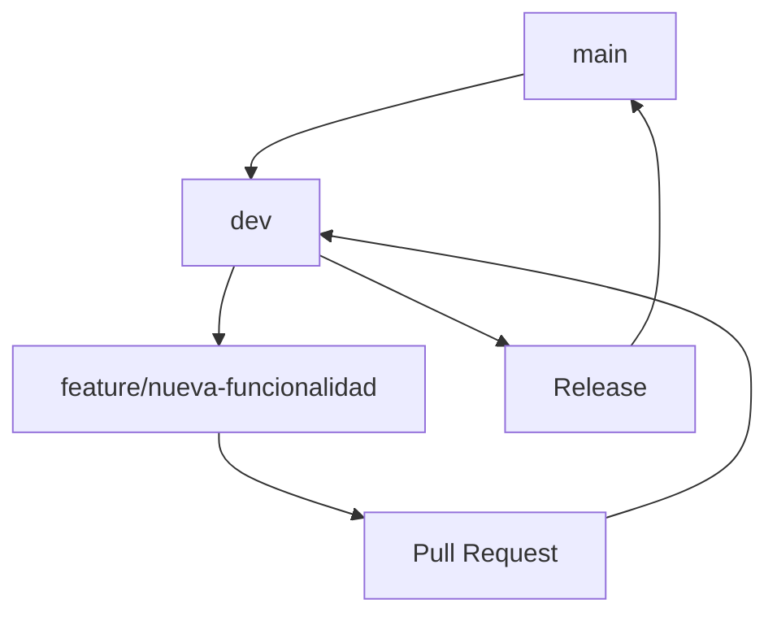

# 🚀 NLP Grupo 5 - Proyecto de Procesamiento de Lenguaje Natural


¡Bienvenidos al repositorio del Grupo 5 para el proyecto de NLP!

## 📋 Descripción del Proyecto

Este repositorio contiene el desarrollo completo de un proyecto de procesamiento de lenguaje natural (NLP), incluyendo análisis de datos, modelos de machine learning, backend API y frontend para la visualización de resultados.

## 📂 Resumen Rápido de Carpetas

| Carpeta | Descripción |
|---------|-------------|
| 📁 **backend** | Código del servidor y API |
| 📁 **data** | Archivos CSV originales y modificados |
| 📁 **db** | Bases de datos y scripts relacionados |
| 📁 **frontend** | Interfaz web para mostrar resultados |
| 📁 **models** | Modelos entrenados (.pkl, .h5, .pth) |
| 📁 **notebooks** | Archivos .ipynb para análisis |
| 📁 **tests** | Pruebas unitarias y de integración |

## 🏗️ Estructura Detallada del Proyecto

### 📁 **backend/**
**Responsable**: Equipo de Backend  
**Contenido**: 
- API REST desarrollada en Python (Flask/FastAPI)
- Endpoints para servir los modelos de ML
- Lógica de negocio y procesamiento de datos
- Archivos de configuración del servidor
- Middleware y autenticación

### 📁 **data/**
**Responsable**: Equipo de Data Science  
**Contenido**: 
- **Archivos CSV originales**: Datasets sin procesar tal como se obtuvieron de las fuentes
- **Archivos CSV modificados**: Datasets procesados, limpiados y preparados para entrenamiento

### 📁 **db/**
**Responsable**: Equipo de Backend/Data  
**Contenido**: 
- Archivos de base de datos (SQLite, PostgreSQL dumps, etc.)
- Scripts de migración y creación de esquemas
- Configuraciones de conexión a BD
- Backup de datos importantes

### 📁 **frontend/**
**Responsable**: Equipo de Frontend  
**Contenido**: 
- Aplicación web para visualización de resultados
- Interfaz de usuario para interactuar con los modelos
- Dashboard de métricas y resultados

**Tecnologías sugeridas**: React, Vue.js, o HTML/CSS/JavaScript vanilla

### 📁 **models/**
**Responsable**: Equipo de ML/Data Science  
**Contenido**: 
- **Archivos .pkl**: Modelos serializados con pickle
- **Archivos .h5**: Modelos de deep learning (Keras/TensorFlow)
- **Archivos .pth**: Modelos de PyTorch
- Configuraciones de hiperparámetros
- Métricas y evaluaciones de modelos

### 📁 **notebooks/**
**Responsable**: Equipo de Data Science  
**Contenido**: 
- Jupyter Notebooks para análisis exploratorio
- Notebooks de entrenamiento de modelos
- Visualizaciones y reportes
- Experimentación y prototipado

**Convención de nombres**: `nombre_de_modelo_autor.ipynb`

### 📁 **tests/**
**Responsable**: Todo el equipo  
**Contenido**: 
- Tests unitarios para funciones críticas
- Tests de integración para APIs
- Tests de rendimiento de modelos
- Configuraciones de testing

## 🛠️ Configuración del Entorno

### Requisitos Previos

✅ Python 3.11 (versión específica requerida)  
✅ Node.js 16+ y npm  
✅ Git  
✅ Pip  

### Instalación del Backend

```bash
# 1. Clonar el repositorio
git clone https://github.com/MaximilianoScarlato/nlp_grupo_5.git
cd nlp_grupo_5_proyecto_10

# 2. Instalar Python 3.11 (si no está instalado)
# Para Windows: Descargar de https://www.python.org/downloads/release/python-3117/
# Para Linux:
# sudo apt update
# sudo apt install python3.11 python3.11-venv python3.11-dev

# 3. Crear y activar un entorno virtual con Python 3.11
# En Windows
python3.11 -m venv venv
# Activar el entorno
venv\Scripts\activate

# En Linux/Mac
python3.11 -m venv venv
# Activar el entorno
source venv/bin/activate

# 4. Instalar dependencias
pip install -r requirements.txt

# 5. Descargar recursos de NLTK necesarios
python -c "import nltk; nltk.download('punkt'); nltk.download('stopwords'); nltk.download('wordnet'); nltk.download('omw-1.4')"
```

### Instalación del Frontend

```bash
# 1. Navegar al directorio del frontend
cd frontend

# 2. Instalar dependencias del frontend
npm install
```

## ▶️ Ejecución del Proyecto

### Ejecutar el Backend

```bash
# Asegúrate de estar en el directorio raíz del proyecto y tener el entorno virtual activado

# Iniciar el servidor backend con Python 3.11
uvicorn app.main:app --reload --host 0.0.0.0 --port 8000

# El API estará disponible en http://localhost:8000
# La documentación Swagger estará en http://localhost:8000/docs
```

### Ejecutar el Frontend

```bash
# En una terminal diferente, navegar al directorio del frontend
cd frontend

# Iniciar el servidor de desarrollo
npm run dev

# El frontend estará disponible en http://localhost:5173
```

## 🔄 Flujo de Trabajo (Git Flow)

### Ramas Principales
- **`main`**: Código estable y listo para producción
- **`dev`**: Rama de desarrollo donde se integran las nuevas características

### Flujo de Desarrollo



1. Crear una rama feature desde `dev`: `git checkout -b feature/nombre-caracteristica`
2. Desarrollar la funcionalidad
3. Hacer commit de los cambios: `git commit -m "feat: descripción del cambio"`
4. Push de la rama: `git push origin feature/nombre-caracteristica`
5. Crear Pull Request hacia `dev`
6. Revisión de código por el equipo
7. Merge a `dev` después de aprobación

## 📝 Convenciones de Commits

Usar el formato: `tipo: descripción`

| Tipo | Descripción |
|------|-------------|
| `feat` | Nueva funcionalidad |
| `fix` | Corrección de bug |
| `docs` | Cambios en documentación |
| `style` | Cambios de formato (no afectan funcionalidad) |
| `refactor` | Refactorización de código |
| `test` | Añadir o modificar tests |
| `data` | Cambios en datasets o procesamiento de datos |

## 👥 Equipo

| Miembro | Rol |
|---------|-----|
| Anca | Frontend |
| Maximiliano | Scrum Master |
| Orlando | Backend |
| Polina | Data Scientist |
| Stephany |  ML Engineer |

---

## 🔧 Resolución de Problemas Comunes

<details>
<summary>💥 Error al instalar dependencias con pip</summary>
<p>
Si encuentras errores relacionados con las versiones de pip, prueba actualizar pip primero:

```bash
python -m pip install --upgrade pip
```
</p>
</details>

<details>
<summary>💥 Errores de recursos NLTK no encontrados</summary>
<p>
Si aparecen errores indicando que no se encuentran recursos de NLTK (como stopwords, punkt, etc.), ejecuta:

```bash
python -c "import nltk; nltk.download('punkt'); nltk.download('stopwords'); nltk.download('wordnet'); nltk.download('omw-1.4')"
```
</p>
</details>

<details>
<summary>💥 Error en notebooks de PyTorch</summary>
<p>
Si encuentras errores de indentación en la sección 6 del notebook de PyTorch, verifica que el bloque de comparación de modelos esté correctamente indentado. Se ha corregido en la versión actual.
</p>
</details>

<details>
<summary>💥 Problemas con el Frontend</summary>
<p>
Si aparecen errores relacionados con paquetes faltantes en el frontend, asegúrate de ejecutar `npm install` en el directorio frontend. Si persisten los problemas, prueba con:

```bash
cd frontend
npm install vite@latest
npm run dev
```
</p>
</details>

<details>
<summary>💥 Incompatibilidad con versiones de Python</summary>
<p>
Este proyecto requiere específicamente Python 3.11. Si tienes múltiples versiones de Python instaladas, asegúrate de usar pip asociado a Python 3.11:

```bash
# En Windows
py -3.11 -m pip install -r requirements.txt

# En Linux/Mac
python3.11 -m pip install -r requirements.txt
```
</p>
</details>

---

**Última actualización**: Junio 2025  
**Versión**: 2.0.0